# For Goodness Bakes

[For Goodness Bakes](https://for-goodness-bakes-app-93b97c50dd02.herokuapp.com/ "For Goodness Bakes | Heroku")

A full stack Django web application where users can browse recipes and, once logged in, create, edit, and delete comments on recipes. For Goodness Bakes is a relaxed and friendly community for bakers of all levels to come together for interaction and support from similar minded individuals. The platform focuses on clean UX, accessibility, secure authentication, and robust CRUD functionality.

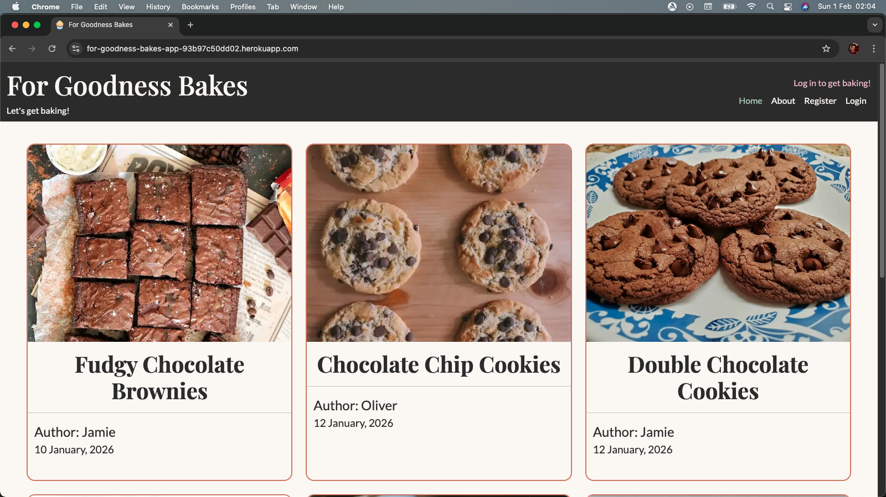

### [Contents](#contents)
* [User Goals](#user-goals)
* [User Stories](#user-stories)
* [User Feedback](#user-feedback)
* [Website Goals](#website-goals)
* [Website Objectives](#website-objectives)
* [Target Audience](#target-audience) 
* [Wireframes](#wireframes)
* [Design Choices](#design-choices)
    + [Typography](#typography)
    + [Colour Scheme](#colour-scheme)
    + [Images](#images)
    + [Responsiveness](#responsiveness)
* [Security Measures and Protective Design](#security-measures-and-protective-design)
    + [User Authentication](#user-authentication)
    + [Password Management](#password-management)
    + [Form Validation](#form-validation)
    + [Database Security](#database-security)
* [Features](#features)
    * [Existing Features](#existing-features)
        + [Header](#header)
        + [Home Section](#home-section)
        + [Registration](#registration)
        + [Login Section](#login-section)
        + [About Section](#about-section)
        + [Success Page](#success-page)
        + [404 Error Page](#404-error-page)
        + [Footer](#footer)
    * [Future Enhancements](#future-enhancements)
* [Technologies Used](#technologies-used)
    * [Languages](#languages)
    * [Libraries and Frameworks](#libraries-and-frameworks)
    * [Tools and Programmes](#tools-and-programmes)
* [Testing](#testing)
    * [Bugs](#bugs)
    * [Responsiveness Tests](#responsiveness-tests)
    * [Code Validation](#code-validation)
        + [HTML](#html)
        + [CSS](#css)
        + [JavaScript](#javascript)
    * [User Story Testing](#user-story-testing)
    * [Feature Testing](#feature-testing)
    * [Accessibility Testing](#accessibility-testing)
    * [Lighthouse Testing](#lighthouse-testing)
    * [Browser Testing](#browser-testing)
* [Deployment](#deployment)
* [Credits](#credits)

## User Goals

### Public Users:
* Display all recipes for public users, authenticated users and admin.
* Each recipe has an individual detail page for public users, authenticated users and admin to view.
* Public users can read comments on recipes.
* Public users can register for an account.

### Authenticated Users:
* Authenticated users can log in and out.
* Authenticated users can create comments on recipes with immediate UI feedback.
* Authenticated users can edit and delete their own comments with immediate UI feedback.

### Admin:
* Admin can create, edit and delete recipes.
* Admin can moderate comments.

[Back to contents](#contents)

## User Stories

### Public Users:
* As a public user, I want to browse a list of recipes and view individual recipe details so that I can find recipes to bake without needing to register.
* As a new user, I want to create an account and log in securely so that I can participate in commenting on recipes.

### Authenticated Users:
* As an authenticated user, I want to add comments to recipes so that I can share feedback, baking tips and interact with other users.
* As an authenticated user, I want to edit my own comment so that I can correct mistakes or update my advice.
* As an authenticated user, I want to delete my own comment so that I can remove content I no longer want displayed.

### Admin:
* As an admin, I want to create new recipes so that fresh content can be added to the site for users to explore.
* As an admin, I want to edit existing recipes so that I can correct errors or improve recipe content.
* As an admin, I want to delete recipes so that outdated or incorrect content can be removed.
* As an admin, I want to manage user comments so that inappropriate or spam content can be removed.

These user stories have been prioritied using the MoSCoW Prioritisation method. GitHub Project Board was then used to manage workflow and track progress towards completion of each story and ensuring all required elements of the user stories were met.

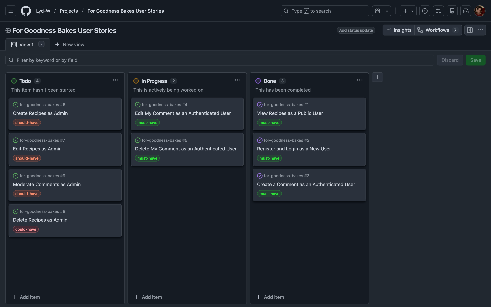

[Back to contents](#contents)

## User Feedback

Feedback was gathered informally through family and friends reviewing and testing during development. Users highlighted the clean and welcoming design, ease of navigation, and clarity of recipe information as key strengths.

Positive feedback included:
- The website is easy to navigate across devices.
- Recipe pages are clear and well structured.
- Commenting functionality is intuitive and responsive.
- The colour palette and typography create a calm, friendly atmosphere.

Suggested improvements included:
- Adding search or filtering options for recipes.
- Allowing users to save favourite recipes.
- Expanding user interaction beyond comments.

These suggestions have been considered and are documented within the Future Enhancements section.

[Back to contents](#contents)

## Website Goals

The key website goals are to provide users with a safe community to browse recipe ideas and, when authenticated, engage with the community through posting, editing and deleting their own comments. Administrators will provide this safe community through their abilitiy to moderate user comments and add or amend recipe information. 

[Back to contents](#contents)

## Website Objectives

* To provide clearly structured and visually appealing recipe content for public users, authenticated users and admin, ensuring information is easy to find, read and navigate across different devices.
* To provide intuitive navigation onto individual recipe pages from the recipe listing page, keeping the layout consistent with clear information and easily accessible navigation controls.
* Enable secure registration for new users, with clear UI confirmation.
* Enable secure log in/out for existing users, with clear UI confirmation.
* Ability for only authenticated users to comment on recipes, including editing and deleting thier own comments successfully, with prior prompting before deletion and activity confirmation.
* All sensitive user and site data is suitably protected, following best practiuce for secure data handling.
* Allow users with administrative access to manage recipe content and moderate user comments to ensure accuracy, relevance and appropriate for the target audience.
* Ensure all data input is validated and users are clearly notified of errors in data input. 
* Inclusion of an error page to direct users back to the homepage if a broken link or error occurs.

[Back to contents](#contents)

## Target Audience

* Home bakers
* Food enthusiasts
* Users who want to discuss and improve recipes
* Beginner to intermediate bakers seeking advice
* Beginner to intermediate bakers wanting to share advice
* Users wanting to be part of a baking community
* Families

[Back to contents](#contents)

## Wireframes

Wireframes were created using [Draw.io](https://www.drawio.com/ "Draw.io Homepage"). A mobile first approach was taken throughout, the wireframes provided a visual respresentation of the expected layout and structure of the website. Within the wireframes, key element placement is visible for navigation, content and interactive areas.  

[Mobile Wireframes](docs/mobile-wireframes.png "Mobile Wireframes")

[Tablet Wireframes](docs/tablet-wireframes.png "Tablet Wireframes")

[Desktop Wireframes](docs/desktop-wireframes.png "Laptop Wireframes")

[Back to contents](#contents)

## Design Choices

### Typography

The primary font family that was chosen for For Goodness Bakes was [Playfair Display](https://fonts.google.com/specimen/Playfair+Display?query=playfair+display "Google Fonts | Playfair Display"), the soft curves of the serif style offers a warm and personal feeling to welcome users into the website. Playfair Display offers a familiar magazine feeling, helping users to feel comfortable and invited to interact with the recipes and other users. This font was used for recipe titles and headings.

The secondary font family that was chosen for For Goodness Bakes was [Lato](https://fonts.google.com/specimen/Lato "Google Fonts | Lato") due to its readability through its clean letter design and professional yet friendly appearance while remaining neutral enough to not compete with the headings. Lato offers legibility for longer bodies of text making it ideal for recipe descriptions, ingredient lists, instructions and comments.

Together, these font groups help to create visual balance, offering warmth and an easy reading experience. The use of a serif font for headings and a sans-serif font for body text also provides easy visual distinction for users.

### Colour Scheme

To visualise different colours together [Coolors Scheme](https://coolors.co/2b2b2b-faf7f2-e8b7c8-a8c3b1-c97a5d "Coolors Scheme | For Goodness Bakes") was used to create a fitting combination for the website. Graphite was chosen for the font colour for the feeling of professionalism and ease of legibility whilst being easier on the eyes which was ideal for body text, headings and icons. Parchment was used to create a calmer, welcoming approach. This creates the feeling of reading from paper, suggesting cookbook pages, giving a better UX, therefore this colour was ideal for the website background. Soft Blossom was used to bring in a comforting, feminine touch whilst not being too overpowering, and was used for buttons, links and navigation. To reinforce the calm atmosphere the website aimed for, Ash Grey was selected, this helped to bring a natural, healthier balance to the Soft Blossom because greens are often associated with food and wellness. The final colour used was Burnt Peach, being a similar colour to spices it felt a natural choice for a baking website, bringing a sharp enphasis among the other colours making it ideal for buttons such as submitting,  commenting or hovers and borders.

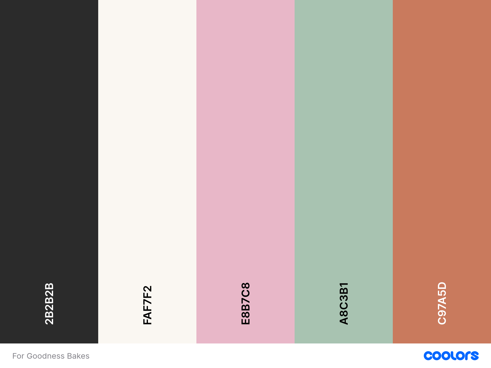

[Contrast Grid](https://contrast-grid.eightshapes.com/?version=1.1.0&background-colors=&foreground-colors=%23FAF7F2%0D%0A%23E8B7C8%0D%0A%23C97A5D%0D%0A%23A8C3B1%0D%0A%232B2B2B&es-color-form__tile-size=regular&es-color-form__show-contrast=aaa&es-color-form__show-contrast=aa&es-color-form__show-contrast=aa18&es-color-form__show-contrast=dnp "Contrast Grid") was used to determine the best colour combinations to ensure the website was visually appealing whilst remaining easy for the user to read the content.

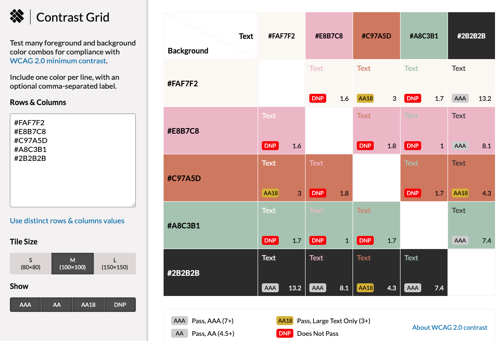

|CSS Name               |HEX          |Use
|-----------------------|-------------|------------------------------------------------|
| --primary | #FAF7F2 | Website background colour |
| --secondary | #E8B7C8 | Buttons, links, navigation  |
| --primary-highlight | #C97A5D | Button hover and borders, submission button |
| --secondary-highlight | #A8C3B1 | Secondary buttons, success messages |
| --text | #2B2B2B | Primary text colour |
| --danger | #E8B7C8 | Danger buttons (delete, log out) |
| --success | #A8C3B1 | Success button (send, submit) |

### Images

High-quality food photography is used throughout the website to enhance visual appeal and encourage user engagement. Images were sourced from Unsplash and Pexels, ensuring consistency with the website’s warm and welcoming aesthetic.

All images are optimised for web performance to reduce load times while maintaining visual clarity. Placeholder images are used where necessary to maintain layout consistency and prevent broken image links.

Each recipe includes a featured image to help users quickly identify content and enhance the overall browsing experience.

### Responsiveness

A mobile-first approach was taken throughout the design and development process. [Bootstrap](https://getbootstrap.com/docs/5.3/layout/breakpoints/#available-breakpoints "Bootstrap Breakpoints")’s responsive grid system and utility classes were used to ensure the website adapts smoothly across all screen sizes.

The website has been tested on:
- Mobile devices
- Tablets (via [Dev Tools](https://developer.chrome.com/docs/devtools "Chrome | Dev Tools"))
- Desktop and laptop screens

Key responsive features include:
- Collapsible navigation for smaller screens
- Scalable images and typography
- Stacked layouts on mobile that expand into multi-column layouts on larger screens

This ensures a consistent and accessible user experience regardless of device.

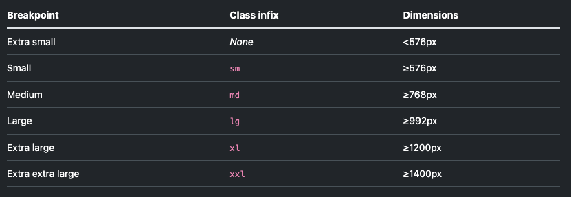

[Back to contents](#contents)

# Security Measures and Protective Design

### User Authentication

User authentication is handled using Django’s built-in authentication system. This ensures secure user registration, login, and logout functionality.

Access control is enforced so that:
- Only authenticated users can create, edit, or delete comments.
- Users can only modify or delete their own comments.
- Administrative features are restricted to superusers.

This protects user content and prevents unauthorised access or modification.

### Password Management

Passwords are securely managed using Django’s password hashing framework. Plain text passwords are never stored.

Additional measures include:
- Password confirmation during registration
- Secure password hashing algorithms
- Automatic protection against common authentication vulnerabilities

This ensures user credentials remain protected at all times.

### Form Validation

Both client-side and server-side form validation are implemented to ensure data integrity and improve user experience.

Validation includes:
- Required field enforcement
- Clear error messages displayed to users
- Prevention of invalid or empty submissions

Users receive immediate feedback if a form submission fails, helping them correct errors efficiently.

### Database Security

In order to protect sensitive configuration values, such as the Django `SECRET_KEY` and database credentials, environment variables are used. These values are stored securely using Heroku Config Vars and are never committed to the repository, with configuration files such as `env.py` excluded via `.gitignore`.

Additional security measures are implemented by ensuring `DEBUG` mode is disabled in production, restricting access using `ALLOWED_HOSTS`, and protecting against cross-site request forgery through trusted origins defined in `CSRF_TRUSTED_ORIGINS`.

The production database is not publicly accessible and can only be accessed through the Django application, ensuring users can only interact with data via the website’s features.

[Back to contents](#contents)
    
# Features

For Goodness Bakes focuses on simplicity, usability, and community interaction. Features are designed to support both casual visitors and registered users while maintaining secure content management.

## Existing Features

### Header

The header provides consistent navigation across the site and adapts responsively to different screen sizes.

Features include:
- Website branding
- Navigation links with highlight to indicate current page
- Authentication-aware options (login/register or logout)

On smaller devices such as mobiles and tablets, the header collapses into a mobile-friendly menu then expands out for clarity on larger screens.

 

<b>Mobile header</b>

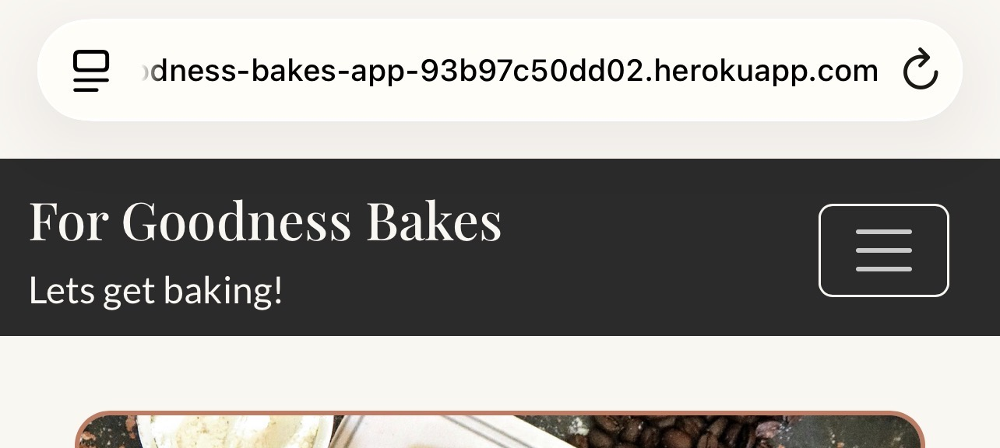

 

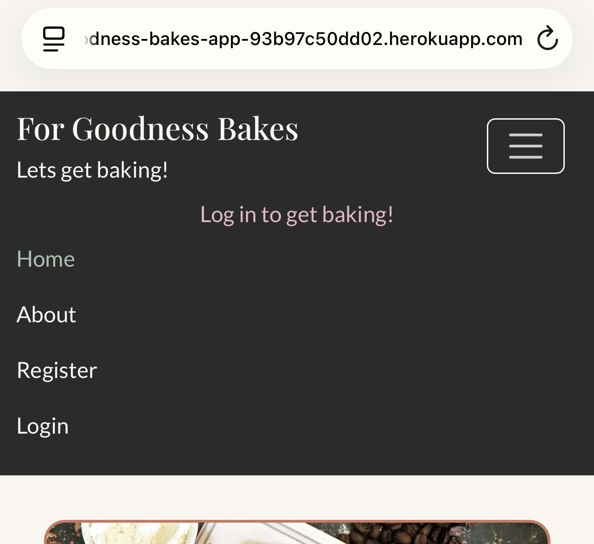

 

<b>Tablet header</b>

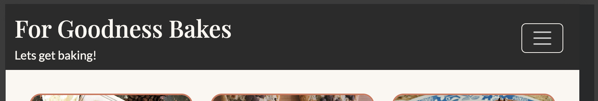

 

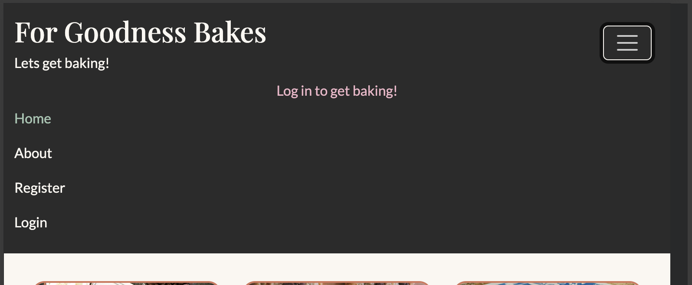

 

<b>Desktop header</b>

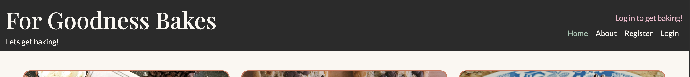

 

### Home Section

The home page displays a list of available recipes in a clean, visually appealing layout. Each recipe card includes:
- A featured image
- Recipe title
- Short description

Users can click through to individual recipe pages for full details.

 

 

### Registration

New users can register for an account using a secure and intuitive form. Upon successful registration, users receive clear feedback and can log in immediately to access commenting features.

 

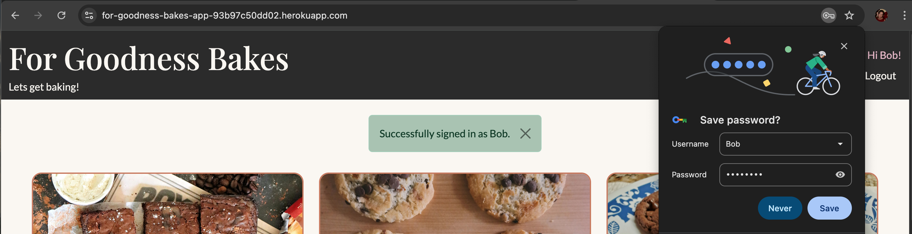

 

### Login and Logout Sections

Registered users can log in securely using their credentials. Clear confirmation messages are displayed on successful login and logout, improving user confidence and clarity.

 

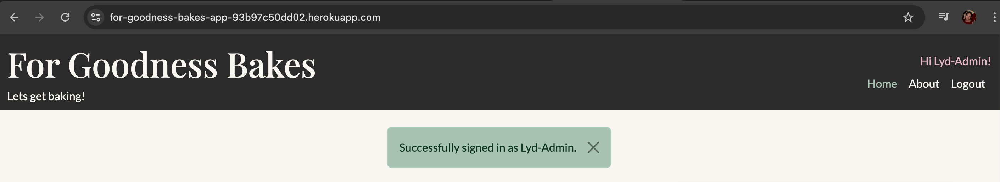

 

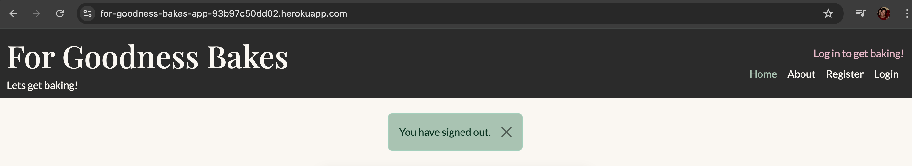

 

### About Section

About section information to be added here.

 

### Success Page

Success page information to be added here.

 

### 404 Error Page

Error page information to be added here.

 

### Footer

Footer information to be added here.

## Future Enhancements

[Back to contents](#contents)

# Technologies Used

## Languages

- [CSS](https://developer.mozilla.org/en-US/docs/Web/CSS "CSS")
- [HTML](https://developer.mozilla.org/en-US/docs/Web/HTML "HTML")
- [JavaScript](https://developer.mozilla.org/en-US/docs/Web/JavaScript "JavaScript")
- [Markdown](https://en.wikipedia.org/wiki/Markdown "Markdown")
- [Python](https://www.python.org/ "Python")

## Libraries and Frameworks

- [Bootstrap v5.3](https://getbootstrap.com/ "Bootstrap v5.3 Homepage")
- [Django](https://www.djangoproject.com/ "Django Homepage")
- [Favicon](https://favicon.io/ "Favicon Homepage")
- [Font Awesome](https://fontawesome.com/search?q=menu&o=r&ic=free "Font Awesome Homepage")
- [Google Fonts](https://fonts.google.com/ "Google Fonts Homepage")

## Tools and Programmes

- [Contrast Grid](https://contrast-grid.eightshapes.com/?version=1.1.0&background-colors=&foreground-colors=%23FAF7F2%0D%0A%23E8B7C8%0D%0A%23C97A5D%0D%0A%23A8C3B1%0D%0A%232B2B2B&es-color-form__tile-size=regular&es-color-form__show-contrast=aaa&es-color-form__show-contrast=aa&es-color-form__show-contrast=aa18&es-color-form__show-contrast=dnp "Contrast Grid")
- [Coolors](http://https://coolors.co/ "Coolors")
- [Draw.io](https://www.drawio.com/ "Draw.io Homepage")
- [GitHub](https://github.com "GitHub Homepage")
- [Heroku](https://www.heroku.com/ "Heroku")
- [Prettier](https://marketplace.visualstudio.com/items?itemName=esbenp.prettier-vscode "Prettier - Code Formatter")
- [VS Code](https://code.visualstudio.com/ "VS Code Homepage")
- [W3C CSS Validation Service](https://jigsaw.w3.org/css-validator/#validate_by_input "W3C CSS Validation Service Homepage")
- [W3C HTML Validation Service](https://validator.w3.org/#validate_by_uri "W3C HTML Validation Service Homepage")

[Back to contents](#contents)

# Testing

## Bugs

|   Bug Description                         | Resolved |    Resolution Description                               |
|-------------------------------------------|----------|---------------------------------------------------------|

## Responsiveness Tests

Responsiveness tests information to be added here.

## Code Validation

### HTML

HTML information to be added here.

### CSS

CSS information to be added here.

### JavaScript

JavaScript information to be added here.

### Python

Python information to be added here.

## User Story Testing

|User Story                               | Result                                      |Pass| Evidence             |
|-----------------------------------------|---------------------------------------------|----|----------------------|
| As a public user, I want to browse a list of recipes and view individual recipe details so that I can find recipes to bake without needing to register. | Result | Pass | Evidence |
| As a new user, I want to create an account and log in securely so that I can participate in commenting on recipes. | Result | Pass | Evidence |
| As an authenticated user, I want to add comments to recipes so that I can share feedback, baking tips and interact with other users. | Result | Pass | Evidence |
| As an authenticated user, I want to edit my own comment so that I can correct mistakes or update my advice. | Result | Pass | Evidence |
| As an authenticated user, I want to delete my own comment so that I can remove content I no longer want displayed. | Result | Pass | Evidence | 
| As an admin, I want to create new recipes so that fresh content can be added to the site for users to explore. | Result | Pass | Evidence |
| As an admin, I want to edit existing recipes so that I can correct errors or improve recipe content. | Result | Pass | Evidence |
| As an admin, I want to delete recipes so that outdated or incorrect content can be removed. | Result | Pass | Evidence |
| As an admin, I want to manage user comments so that inappropriate or spam content can be removed. | Result | Pass | Evidence |

[Back to contents](#contents)

## Feature Testing

Feature testing information to be added here.

## Accessibility Testing

Accessibility testing information to be added here.

## Lighthouse Testing

Lighthouse testing information to be added here.

## Browser Testing

Browser testing information to be added here.

[Back to contents](#contents)

# Deployment

The project was deployed to Heroku from VS Code early on, this allowed for more opportunity to notice errors, as well as to view and test the website at regular intervals. The steps used for deploment were as follows:

## Step One - Create a New Heroku App
- Log into Heroku and access your dashboard.
- Click **"New"** from the top right corner of your dashboard and select **'Create new app'**.
- Enter a unique name for your app and choose your closest region (EU or USA), click **'Create app'** to create your app.
## Step Two - Configure Environment Variables
- Go to the **'Settings'** tab of your new app, in the **'Config Vars'** section, click **'Reveal Config Vars'**.
- Add the following keys and values:

| KEY | VALUE |
|-----|-------|
| DATABASE_URL | Insert your own PostgreSQL database URL here. |
| DISABLE_COLLECTSTATIC | Set the value to **'1'** temporarily and remove it before the final deployment. |
| SECRET_KEY | Enter a random secret key, this can be randomly generated using a website such as [Djecrety](https://djecrety.ir/ "Djecrety").

## Step Three - Prepare the Project for Deployment in the IDE
- Create a **'requirements.txt'** file to list all of the dependancies required by your project. This can be done by running **'pip3 install -r requirements.txt'** in the terminal, it can then be updated to include any other packages installed by running **'pip3 freeze --local > requirements.txt'** in the terminal.
- Install **'gunicorn'** using the command **'pip3 install gunicorn~=20.1'** in the terminal and update **'requirements.txt'**.
- Create a **'Procfile'** in the root directory of the project, add the following line of code to the Procfile **'web: gunicorn project_name.wsgi'**. Ensure project_name matches the project's name.
- Update the **'ALLOWED_HOSTS'** list in **'settings.py'** to include **'.herokuapp.com',**. 
## Step Four - Connect Your GitHub Respository to Heroku
- On the Heroku dashboard, click on the **'Deploy'** tab, in the **'Deployment method'** section, click **'GitHub Connect to GitHub'** where you will be prompted to authenticate with GitHub.
- Type your project repo name into the search box and click **'Search'**, select the correct repo name.
- Scroll down to the **'Manual Deploy'** section, ensure the **'Choose a branch to deploy'** is set to **'main'**, then click on the **'Deploy Branch'** button.
- Once the **'Your app was successfully deployed.'** message is displayed, click the **'View'** button to open your deployed project in a new tab.

[Back to contents](#contents)

# Credits

#### Feedback, advice and support

- 

#### Learning Resources and Guidance

- [Code Institute](https://codeinstitute.net/ "Code Institute")
- [MDN](https://developer.mozilla.org/en-US/ "MDN | Homepage")
- [Slack](https://slack.com/intl/en-gb/ "Slack")
- [Stack Overflow](https://stackoverflow.com/ "Stack Overflow")
- [W3 Schools](https://www.w3schools.com/ "W3 Schools")

#### Images:

All images were sourced from Unsplash and Pexels and are used in accordance with their respective free-use licences. Attribution is provided where recommended.

- Almond Biscotti [Cook Eat](https://www.pexels.com/photo/sliced-bread-on-green-surface-776859/ "Pexels | Cook Eat")
- [Favicon.io](https://favicon.io "Favicon.io")
- Baked Vanilla Cheesecake [A Studios](https://unsplash.com/photos/a-piece-of-cheesecake-on-a-plate-next-to-a-cup-of-tea-rWAwhghF4ag "Unsplash | A Studios")
- Banana Bread [Jeff Siepman](https://unsplash.com/photos/sliced-cakes-MssPSnkV1yM "Unsplash | Jeff Siepman")
- Blueberry Muffins [Joshua Flores](https://unsplash.com/photos/brown-cupcakes-on-white-ceramic-plate-5RQffqRkmWQ "Unsplash | Joshua Flores")
- Chocolate Cake [Polina Tankilevitch](https://www.pexels.com/photo/person-eating-chocolate-cake-4187672/ "Pexels | Polina Tankilevitch")
- Chocolate Cheesecake [American Heritage Chocolate](https://unsplash.com/photos/a-slice-of-chocolate-cheesecake-with-a-strawberry-on-top-DOWsiEekKIA "Unsplash | American Heritage Chocolate")
- Chocolate Chip Banana Bread [Dasha Klimova](https://www.pexels.com/photo/photograph-of-brown-cake-9928323/ "Pexels | Dasha Klimova")
- Chocolate Chip Cookies [Brigitte Tohm](https://www.pexels.com/photo/brown-cookies-189536/ "Pexels | Brigitte Tohm")
- Chocolate Fudge Cake [Richard Bell](https://unsplash.com/photos/a-piece-of-chocolate-cake-on-a-plate-Oul4t1hvQZQ "Unsplash | Richard Bell")
- Chocolate Mousse [American Heritage Chocolate](https://unsplash.com/photos/two-bowls-of-chocolate-pudding-with-raspberries-on-the-side-YxjIO0LmDO0 "Unsplash | American Heritage Chocolate")
- Crème Brûlée [Max Griss](https://unsplash.com/photos/white-ceramic-bowl-with-brown-soup-Wp7ZsJYWP0M "Unsplash | Max Griss")
- Double Chocolate Cookies [Karolina Bobek](https://unsplash.com/photos/cookies-on-white-and-blue-ceramic-plate-hgzPdjwSHEI "Unsplash | Karolina Bobek")
- Fudgy Chocolate Brownie [Saveurs Secretes](https://www.pexels.com/photo/slices-of-chocolate-brownies-5410404/ "Pexels | Saveurs Secretes")
- Jamie and Oliver [Julien Lenoir](https://unsplash.com/photos/a-couple-of-men-standing-next-to-each-other-in-a-kitchen-9WalxeSSSak "Unsplash | Julien Lenoir") - Image edited using [ChatGPT](https://chatgpt.com/ "ChatGPT | Homepage") to remove visible logos.
- Lemon Shortbread Cookies [Kader D. Kahraman](https://www.pexels.com/photo/heap-of-cookies-15776576/ "Pexels | Kader D. Kahraman")
- Placeholder for about - Created by [ChatGPT](https://chatgpt.com/ "ChatGPT | Homepage").
- Placeholder for recipe images [Calum Lewis](https://unsplash.com/photos/wooden-ladle-and-spatula-on-top-of-table-rkT_TG5NKF8 "Unsplash | Calum Lewis")
- Shortbread Biscuits [Shay Wood](https://www.pexels.com/photo/white-and-blue-ceramic-saucer-574125/ "Pexels | Shay Wood")
- Strawberry Victoria Sponge [Becky Fantham](https://unsplash.com/photos/fruit-cake-on-blue-cake-holder-DIUJSBiJNoc "Unsplash | Becky Fantham")
- Vanilla Blondie [Liana S](https://unsplash.com/photos/a-person-holding-a-piece-of-cake-on-a-wooden-plate-1vsupadWQDI "Unsplash | Liana S")
- Victoria Sponge [Nick Fewings](https://unsplash.com/photos/brown-bread-on-stainless-steel-plate-9t_v5yHAW-o "Unsplash | Nick Fewings")

#### Content:

- [ChatGPT](https://chatgpt.com/ "ChatGPT | Homepage") was used to create recipes and the information about For Goodness Bakes.

#### Visual Content:

- [Contrast Grid](https://contrast-grid.eightshapes.com/?version=1.1.0&background-colors=&foreground-colors=%23FAF7F2%0D%0A%23E8B7C8%0D%0A%23C97A5D%0D%0A%23A8C3B1%0D%0A%232B2B2B&es-color-form__tile-size=regular&es-color-form__show-contrast=aaa&es-color-form__show-contrast=aa&es-color-form__show-contrast=aa18&es-color-form__show-contrast=dnp "Contrast Grid")
- [Coolors Scheme](https://coolors.co/ "Coolors Scheme Homepage")

[Back to contents](#contents)