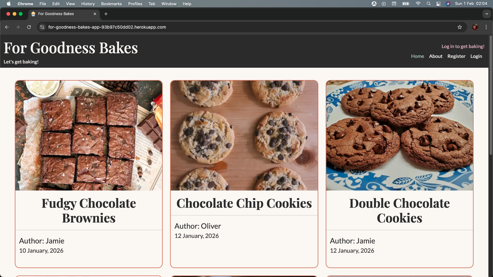

# For Goodness Bakes

[For Goodness Bakes](https://lyd-w.github.io/for-goodness-bakes/ "For Goodness Bakes | Github")

A full‑stack Django web application where users can browse recipes and, once logged in, create, edit, and delete comments on recipes. For Goodness Bakes is a relaxed and friendly community for bakers of all levels to come together for interaction and support from similar minded individuals. The platform focuses on clean UX, accessibility, secure authentication, and robust CRUD functionality.

### [Contents](#contents)
* [User Goals](#user-goals)
* [User Stories](#user-stories)
* [User Feedback](#user-feedback)
* [Website Goals and Objectives](#website-goals-and-objectives)
* [Target Audience](#target-audience) 
* [Wireframes](#wireframes)
* [Design Choices](#design-choices)
    + [Typography](#typography)
    + [Colour Scheme](#colour-scheme)
    + [Images](#images)
    + [Responsiveness](#responsiveness)
* [Features](#features)
    * [Existing Features](#existing-features)
        + [Header](#header)
        + [Home Section](#home-section)
        + [Registration](#registration)
        + [Login Section](#login-section)
        + [About Section](#about-section)
        + [Success Page](#success-page)
        + [404 Error Page](#404-error-page)
        + [Footer](#footer)
    * [Future Enhancements](#future-enhancements)
* [Technologies Used](#technologies-used)
    * [Languages](#languages)
    * [Libraries and Frameworks](#libraries-and-frameworks)
    * [Tools and Programmes](#tools-and-programmes)
* [Testing](#testing)
    * [Bugs](#bugs)
    * [Responsiveness Tests](#responsiveness-tests)
    * [Code Validation](#code-validation)
        + [HTML](#html)
        + [CSS](#css)
        + [JavaScript](#javascript)
    * [User Story Testing](#user-story-testing)
    * [Feature Testing](#feature-testing)
    * [Accessibility Testing](#accessibility-testing)
    * [Lighthouse Testing](#lighthouse-testing)
    * [Browser Testing](#browser-testing)
* [Deployment](#deployment)
* [Credits](#credits)

## User Goals

* Display all recipes for public users, authenticated users and admin.
* Each recipe has an individual detail page for public users, authenticated users and admin to view.
* Public users can read comments on recipes.
* Public users can register for an account.
* Authenticated users can log in and out.
* Authenticated users can create comments on recipes with immediate UI feedback.
* Authenticated users can edit and delete their own comments with immediate UI feedback.
* Admin can create, edit and delete recipes.
* Admin can moderate comments.

[Back to contents](#contents)

## User Stories

* As a public user, I want to browse a list of recipes and view individual recipe details so that I can find recipes to bake without needing to register.
* As a new user, I want to create an account and log in securely so that I can participate in commenting on recipes.
* As an authenticated user, I want to add comments to recipes so that I can share feedback, baking tips and interact with other users.
* As an authenticated user, I want to edit my own comment so that I can correct mistakes or update my advice.
* As an authenticated user, I want to delete my own comment so that I can remove content I no longer want displayed.
* As an admin, I want to create new recipes so that fresh content can be added to the site for users to explore.
* As an admin, I want to edit existing recipes so that I can correct errors or improve recipe content.
* As an admin, I want to delete recipes so that outdated or incorrect content can be removed.
* As an admin, I want to manage user comments so that inappropriate or spam content can be removed.

[Back to contents](#contents)

